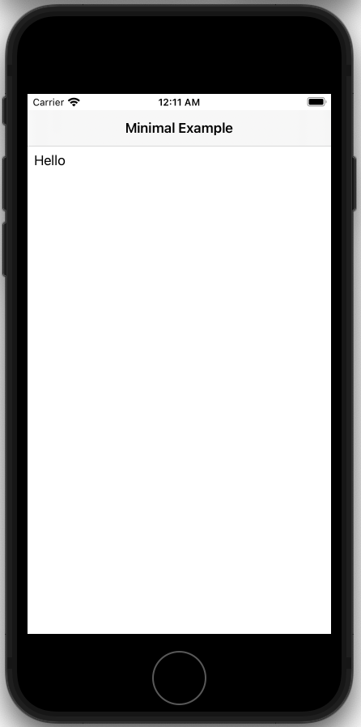

Applin™ Examples
======

# Minimal
[minimal.rs](minimal.rs)

# Clock
[clock.rs](clock.rs)

# Dynamic Page
[dynamic_page.rs](dynamic_page.rs)

# Server State Example
[server_state.rs](server_state.rs)

# Session State Example
[session_state.rs](session_state.rs)

